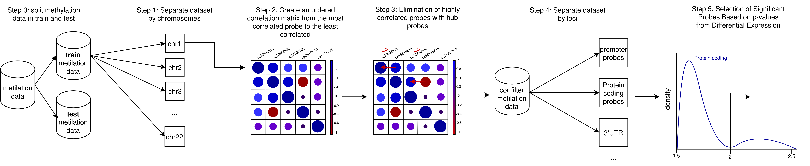

# MES-HDLS Methylation-based Enhanced Signals for High-Dimensional and Low-Sample sized problems

## Motivation

Working with methylation data can be complex, particularly due to the necessity of employing a filtering prior to analysis. We introduce MES-HDLS, a methodology designed to identify the most significant signals without requiring data transformation. 

The primary filtering step in our methodology relies on correlation-based approaches. Given that methylation datasets typically have immense dimensionality, our approach first split data by chromosomes to efficiently apply this filter. If meaningful signals remain elusive after this step, MES-HDLS incorporates an additional locus-level filtering procedure. As a final measure, should signals still not emerge clearly, the methodology selects features with a \(-log_{10}(p\text{-value}) > 2\).

MES-HDLS has been evaluated using four datasets across ten different diseases, successfully identifying signals in three of the datasets and five diseases.



## Requirements

MES-HDLS requires dependencies for both R and Python. Please ensure you have the following libraries installed:

### R Libraries

- **dplyr**
- **IlluminaHumanMethylationEPICanno.ilm10b4.hg19**
- **biomaRt**

### Python Libraries

- **pandas**
- **numpy**
- **cupy**

## How to Use MES-HDLS

Everything necessary to exec MES-HDLS is in the `code` folder. As an example, the train and test datasets from `LBDfcFilteredMyNorm.csv` and its clinical data `LBDfcSamplesheet.csv` have been provided. The clinic data is essential for performing differential expression analysis.

### Split into Train and Test Sets (Optional)

If you wish to split your own dataset into train and test subsets, a Jupyter notebook named `train_test_split.ipynb` is available. For my example, I simply executed the cell following the comment marked `LBDfc`.

### Chromosome-Based Split

To split the dataset by chromosomes, run the R script `split_by_chr.R`. Specify the input dataset and output directory paths. For example, using the provided train dataset, the command would be:

```bash
Rscript split_by_chr.R ../data/LBDfcFilteredMyNorm_train.csv ../data/chr/
```

### Correlation Filtering

The correlation filter identifies and removes highly correlated probes. Probes are ranked from most to least correlated. Starting with the most correlated one, the rest of the probes highly correlated with this one (e.g., 0.7) will be eliminated since the most correlated one will act as a "hub" probe. Then we repeat the process with the second most correlated probe and so on to the last one. This filtering is applied chromosome-wise and subsequently merged.

Due to the large size of the correlation matrices, GPU computation is highly recommended for efficiency. Even with GPU acceleration, large datasets may take hours to process so feel free to take a break and enjoy a coffee!

Execute the filtering process with:

```bash
python3 cor_alg.py ../data/
```

The process outputs intermediate results in `../data`, with the final results located at `./data/final_iteration`.

### Locus-Based Split

To further divide the dataset by loci, run the script `split_by_loci.R`. The dataset provided will be automatically filtered based on the correlation filtering results. Example usage:

```bash
Rscript split_by_loci.R ../data/LBDfcFilteredMyNorm_train.csv
```

### Differential Expression Analysis

Perform differential expression analysis by running the script `diff_exp.R`, providing the testing dataset and training clinical information. Example command:

```bash
Rscript diff_exp.R ../data/LBDfcFilteredMyNorm_test.csv ../data/LBDfcSamplesheet_train.csv
```

**IMPORTANT NOTE**: If you want to apply this analysis to datasets with different diseases, a manual modification of `diff_exp.R` will be necessary. For instance, the current script is set up for diseases MSA, PD, PDD and the control group CTRL, with contrasts defined as:

```R
cm <- limma::makeContrasts(
    DLBvsCTRL    = fDLB - fCTRL,
    PDvsCTRL     = fPD - fCTRL,
    PDDvsCTRL    = fPDD - fCTRL,
    neurovsCTRL  = ((fDLB + fPD + fPDD) / 3) - fCTRL,
    levels = design
  )
```

Adjust the `contrasts` variable accordingly:

```R
contrasts <- c("DLBvsCTRL", "PDvsCTRL", "PDDvsCTRL", "neurovsCTRL")
```

The differencial expression train and test outputs will be in the folder `./data/loci`.

### Full Example

For a full example execution of the workflow, I left a bash file `MES-HDLS.sh` with it.